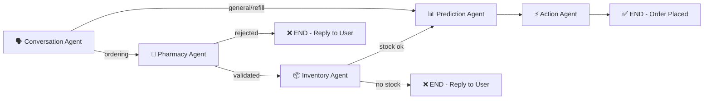

# 🏥 Dhanvan-SageAI — System Architecture & Working

## 1. What is Dhanvan-SageAI?

Dhanvan-SageAI is an **Autonomous Pharmacy Intelligence System** that uses **5 AI agents working together** in a pipeline to handle medicine ordering, prescription processing, and pharmacy operations — all through a simple chat interface.

---

## 2. System Architecture (High Level)

```
┌──────────────┐     ┌──────────────┐     ┌──────────────────────────────────────┐
│   Frontend   │────▶│   Backend    │────▶│         LangGraph Agent Pipeline     │
│  (React/TS)  │◀────│  (FastAPI)   │◀────│  5 Agents working in a chain         │
└──────────────┘     └──────────────┘     └──────────────────────────────────────┘
       │                    │                              │
       │                    ▼                              ▼
       │              ┌──────────┐               ┌──────────────────┐
       │              │ MongoDB  │               │   LangSmith      │
       │              │ Database │               │  (Observability) │
       │              └──────────┘               └──────────────────┘
       │
       ▼
  ┌──────────────┐
  │ GPT-4o Mini  │
  │ Vision (OCR) │
  └──────────────┘
```

### Tech Stack
| Layer | Technology |
|-------|-----------|
| Frontend | React + TypeScript + Vite + ShadCN UI |
| Backend | Python FastAPI |
| AI Pipeline | LangGraph (LangChain) |
| LLM | GPT-4o-mini via OpenRouter |
| OCR | GPT-4o-mini Vision (prescription scanning) |
| Database | MongoDB Atlas |
| Observability | LangSmith |
| Auth | JWT (JSON Web Tokens) |
| PDF | ReportLab (invoice generation) |

---

## 3. The 5-Agent Pipeline (Chain of Thought)

The agents communicate through a **shared state object** (`AgentState`). Each agent reads the state, does its job, updates the state, and passes it to the next agent.



### Agent 1: 🗣️ Conversation Agent
**File:** `backend/agents/conversation_agent.py`
**Job:** Understands what the user wants

- Receives the user's chat message
- Uses GPT-4o-mini to determine the **intent**: `ordering`, `refill_inquiry`, `general`, or `prescription_upload`
- Extracts **entities**: medicine name, quantity, dosage frequency
- If a prescription was recently uploaded, it knows about those medicines too
- **Output:** Sets `intent_type` and `extracted_entities` in the state

**Example Chain of Thought:**
> User says: "I want 2 packets of Paracetamol"
> → Agent thinks: intent = `ordering`, medicine = `Paracetamol`, quantity = `2`

---

### Agent 2: 💊 Pharmacy Design Agent
**File:** `backend/agents/pharmacy_agent.py`
**Job:** Validates the medicine and checks pharmacy policies

- Looks up the medicine in the MongoDB catalogue
- If not found → auto-creates it (for demo purposes)
- Checks if a **prescription is required** for this medicine
- If prescription required but patient doesn't have one → sends to **Pharmacist Queue** for manual review
- **Output:** Sets `validation_passed`, `prescription_required`, and enriches entities with `product_id`, `pzn`, `unit_price`

**Example Chain of Thought:**
> Medicine = Paracetamol → Found in DB → No prescription required → ✅ Validation passed

---

### Agent 3: 📦 Inventory Agent
**File:** `backend/agents/inventory_agent.py`
**Job:** Checks if the medicine is in stock

- Looks up `stock_level` in MongoDB
- If `stock < quantity requested` → rejects the order
- If stock is low (below `reorder_threshold`) → triggers a **reorder flag**
- **Output:** Sets `stock_sufficient` and `reorder_triggered`

**Example Chain of Thought:**
> Paracetamol stock = 100, requested = 2 → 100 ≥ 2 → ✅ Stock sufficient

---

### Agent 4: 📊 Prediction Agent
**File:** `backend/agents/prediction_agent.py`
**Job:** Provides AI-powered health suggestions *(pass-through for ordering flow)*

- For general queries, can suggest alternatives, health tips
- For ordering flow, passes through to Action Agent

---

### Agent 5: ⚡ Action Agent
**File:** `backend/agents/action_agent.py`
**Job:** Executes the order

- Decrements stock in MongoDB
- Creates the **order document** in `db.orders`
- Generates **PDF invoice** using ReportLab
- Sends **order confirmation email** via Resend API
- Fires **fulfillment webhook** (for external systems)
- If reorder was triggered → fires **procurement webhook**
- **Output:** Sets `agent_reply` with order confirmation message

**Example Chain of Thought:**
> Validation ✅, Stock ✅ → Create order ORD-20260301... → Generate invoice → Send email → Reply: "Order placed!"

---

## 4. How Agents Communicate (Shared State)

All 5 agents share a single **`AgentState` dictionary** (defined in `backend/graph_state.py`):

```python
class AgentState(TypedDict):
    session_id: str
    patient_id: str
    input_text: str               # User's message
    chat_history: List[Dict]      # Previous messages
    prescription_context: str     # Recent prescription details
    
    # Set by Conversation Agent
    intent_type: str              # 'ordering', 'refill_inquiry', 'general'
    extracted_entities: Dict      # {medicine, quantity, dosage_frequency}
    
    # Set by Pharmacy Agent
    validation_passed: bool
    rejection_reason: str
    prescription_required: bool
    
    # Set by Inventory Agent
    stock_sufficient: bool
    reorder_triggered: bool
    
    # Set by Action Agent
    order_id: str
    agent_reply: str              # Final reply shown to user
```

**Flow Example:**
```
State starts: {input_text: "order 2 paracetamol", intent_type: ""}
  → Conversation Agent sets: {intent_type: "ordering", entities: {medicine: "Paracetamol", qty: 2}}
  → Pharmacy Agent sets: {validation_passed: true, entities: {..., product_id: "MED-ABC", unit_price: 18.0}}
  → Inventory Agent sets: {stock_sufficient: true}
  → Action Agent sets: {agent_reply: "Order ORD-123 placed! Total: ₹36.00"}
State ends: {agent_reply: "Order placed..."}  ← This is shown to the user
```

---

## 5. Observability (LangSmith)

### Where to See It
Every agent interaction is traced in **LangSmith**. After each chat message, a trace URL is displayed:

```
🔗 Agent trace: https://smith.langchain.com/o/.../r/019ca81f-5dda...
```

### What You Can See in LangSmith
| Feature | What It Shows |
|---------|--------------|
| **Agent Chain** | Visual graph of which agents ran and in what order |
| **LLM Calls** | Exact prompts sent to GPT-4o-mini + responses received |
| **Token Usage** | How many tokens each agent used |
| **Latency** | Time taken by each agent (in milliseconds) |
| **State Changes** | How the AgentState changed after each agent |
| **Errors** | If any agent failed, the exact error and stack trace |

### How It's Implemented
In `backend/routers/chat.py`:
```python
with tracing_v2_enabled(project_name="Dhanvan-SageAI"):
    result = await app_graph.ainvoke(initial_state)
    # Trace URL is extracted and sent back to frontend
```

---

## 6. Prescription OCR Flow

```
Patient uploads image → Frontend sends to /api/prescriptions/upload
  → Backend saves image to disk
  → GPT-4o-mini Vision analyzes the image
  → Returns structured data: {medicines: [...], doctor_name, is_valid}
  → Saved to MongoDB db.prescriptions
  → Frontend auto-calls /api/prescriptions/order-all
  → Backend batch-creates orders for ALL medicines
  → Generates ONE consolidated PDF invoice
  → User sees all orders + download invoice button
```

---

## 7. Bulk Order System

When a prescription is uploaded with multiple medicines:

1. **Vision LLM** extracts all medicines with dosages and quantities
2. **Frontend** automatically calls `POST /api/prescriptions/order-all`
3. **Backend** loops through each medicine:
   - Finds/auto-creates in the catalogue
   - Assigns realistic prices
   - Creates individual order docs in MongoDB
   - Decrements stock
4. **Generates ONE consolidated invoice** with all medicines in a table
5. **Returns** all order IDs, prices, and a consolidated invoice ID
6. **Frontend** shows a download button for the full prescription invoice

---

## 8. Key API Endpoints

| Endpoint | Method | Purpose |
|----------|--------|---------|
| `/api/auth/login` | POST | Patient/Pharmacist login |
| `/api/chat` | POST | Send chat message through agent pipeline |
| `/api/prescriptions/upload` | POST | Upload & OCR a prescription image |
| `/api/prescriptions/order-all` | POST | Batch-order all prescription medicines |
| `/api/invoices/{id}` | GET | Download invoice PDF |
| `/api/orders` | GET | List patient's orders |
| `/api/pharmacist/queue` | GET | Pharmacist review queue |

---

## 9. Database Collections (MongoDB)

| Collection | Purpose |
|-----------|---------|
| `users` | Patient & pharmacist accounts |
| `medicines` | Medicine catalogue (name, price, stock_level) |
| `orders` | All placed orders |
| `prescriptions` | OCR extraction results |
| `chat_history` | Conversation logs |
| `pharmacist_queue` | Orders pending pharmacist review |

---

## 10. File Structure

```
sage-ai/
├── backend/
│   ├── agents/                    # The 5 AI agents
│   │   ├── conversation_agent.py  # Intent + entity extraction
│   │   ├── pharmacy_agent.py      # Medicine validation
│   │   ├── inventory_agent.py     # Stock checking
│   │   ├── prediction_agent.py    # AI predictions
│   │   └── action_agent.py        # Order execution
│   ├── graph.py                   # LangGraph pipeline definition
│   ├── graph_state.py             # Shared AgentState schema
│   ├── routers/
│   │   ├── chat.py                # Chat API endpoint
│   │   ├── prescriptions.py       # OCR + bulk ordering
│   │   ├── invoices.py            # Invoice download
│   │   └── orders.py              # Order management
│   ├── services/
│   │   ├── pdf_service.py         # Invoice PDF generation
│   │   ├── email_service.py       # Order confirmation emails
│   │   └── webhook_service.py     # Fulfillment webhooks
│   ├── auth/                      # JWT authentication
│   └── main.py                    # FastAPI app entry point
├── frontend/
│   └── src/
│       └── pages/
│           ├── PatientDashboard.tsx    # Patient chat + orders UI
│           └── PharmacistDashboard.tsx # Pharmacist admin panel
└── invoices/                      # Generated PDF invoices
```
