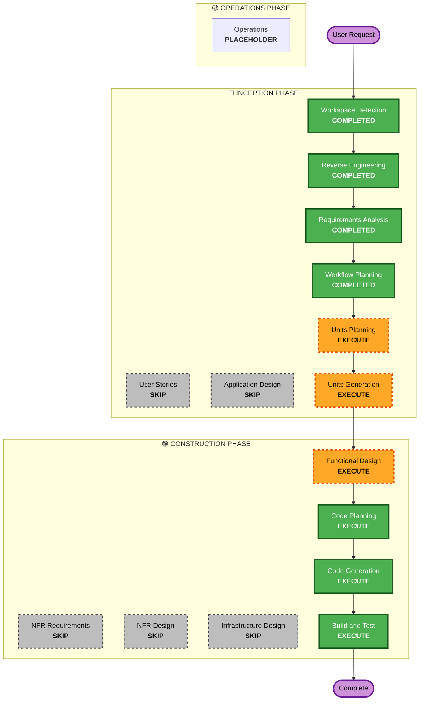

# Execution Plan

## Detailed Analysis Summary

### Transformation Scope (Brownfield Only)
- **Transformation Type**: System-wide Quality Assurance (Testing phase addition)
- **Primary Changes**: Addition of testing suites (pytest, Playwright/Cypress) and LangSmith evaluation configurations.
- **Related Components**: backend/routers, backend/agents, frontend/src/pages

### Change Impact Assessment
- **User-facing changes**: No directly visible structural UX changes, but edge case handling will be formalized to gracefully degrade.
- **Structural changes**: No major architectural shifts; adding tests alongside existing code.
- **Data model changes**: No changes to existing models. 
- **API changes**: No changes. Ensure input validation is solid based on test findings.
- **NFR impact**: Yes - improving reliability and stability (preventing crashes on bad input).

### Component Relationships (Brownfield Only)
- **Primary Component**: New Test Suites (Backend `tests/`, Frontend `e2e/`)
- **Infrastructure Components**: N/A
- **Shared Components**: LangSmith Datasets 
- **Dependent Components**: LangGraph pipeline (backend/agents), FastAPI routes (backend/routers)
- **Supporting Components**: Testing frameworks (pytest, playwright)

### Risk Assessment
- **Risk Level**: Low (Tests do not modify functional code unless bugs are found and fixed).
- **Rollback Complexity**: Easy (Just remove the test files).
- **Testing Complexity**: Complex (Testing non-deterministic LLM behavior via LangSmith and Playwright).

## Workflow Visualization

## Phases to Execute

### 🔵 INCEPTION PHASE
- [x] Workspace Detection (COMPLETED)
- [x] Reverse Engineering (COMPLETED)
- [x] Requirements Elaboration (COMPLETED)
- [x] User Stories (SKIPPED) - *Not applicable for technical QA task*
- [x] Execution Plan (COMPLETED)
- [ ] Application Design - SKIP
  - **Rationale**: We are not designing new application components, just tests for existing ones.
- [ ] Units Planning - EXECUTE
  - **Rationale**: We need to break down the testing effort into logical units (Backend Tests, Frontend Tests, LangSmith).
- [ ] Units Generation - EXECUTE
  - **Rationale**: To organize the testing execution units.

### 🟢 CONSTRUCTION PHASE
- [ ] Functional Design - EXECUTE
  - **Rationale**: We need to define exactly *which* edge case inputs map to exactly *what* expected outputs per test.
- [ ] NFR Requirements - SKIP
  - **Rationale**: No new NFRs. Security extension explicitly skipped.
- [ ] NFR Design - SKIP
  - **Rationale**: Not applicable.
- [ ] Infrastructure Design - SKIP
  - **Rationale**: Not applicable.
- [ ] Code Planning - EXECUTE (ALWAYS)
  - **Rationale**: Implementation approach needed for test scripts.
- [ ] Code Generation - EXECUTE (ALWAYS)
  - **Rationale**: Code implementation needed for pytest and playwright.
- [ ] Build and Test - EXECUTE (ALWAYS)
  - **Rationale**: We actually need to RUN the generated tests.

### 🟡 OPERATIONS PHASE
- [ ] Operations - PLACEHOLDER
  - **Rationale**: Future deployment.

## Estimated Timeline
- **Total Phases**: 7 remaining.
- **Estimated Duration**: ~2-3 hours for comprehensive test generation and execution.

## Success Criteria
- **Primary Goal**: All specified edge cases are covered by automated tests.
- **Key Deliverables**: `pytest` comprehensive test suite, `Playwright` E2E scripts.
- **Integration Testing**: Verify tests fail if existing code breaks, and pass with graceful degradation.
