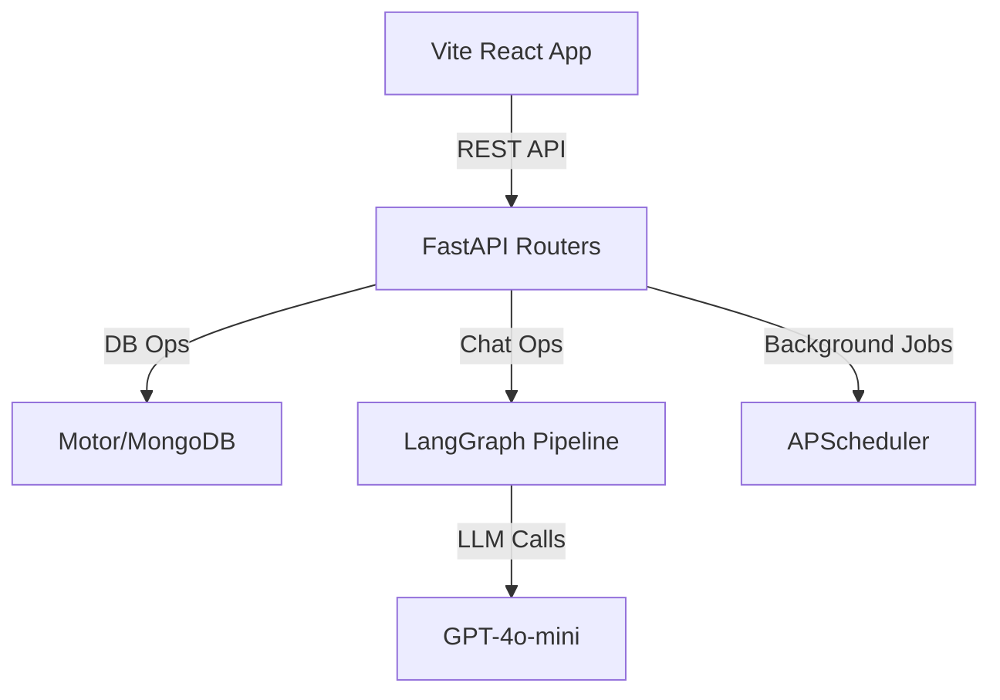
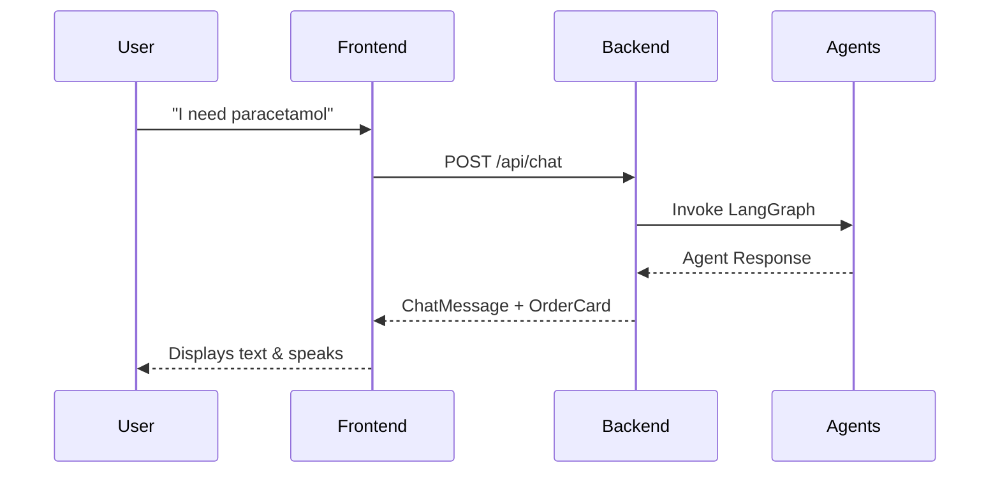

# System Architecture

## System Overview
A React frontend communicating with a FastAPI backend via REST. The backend orchestrates a 5-agent LangGraph pipeline for intelligent natural language interactions and connects to MongoDB for state.

## Architecture Diagram

## Component Descriptions
### Backend
- **Purpose**: API Server
- **Responsibilities**: Auth, Agents, DB access
- **Dependencies**: motor, fastapi, langchain, pydantic
- **Type**: Application

### Frontend
- **Purpose**: User Interface
- **Responsibilities**: Rendering dashboards, voice STT/TTS
- **Dependencies**: React, Tailwind, Shadcn UI, Vite
- **Type**: Client

## Data Flow

## Integration Points
- **External APIs**: OpenAI (LLM), LangSmith (Observability), Resend (Email)
- **Databases**: MongoDB Atlas (Primary Datastore)
- **Third-party Services**: None

## Infrastructure Components
- **CDK Stacks**: N/A (Hackathon local/manual deployment)
- **Deployment Model**: Local dev servers (uvicorn + vite)
- **Networking**: Localhost proxy bridging
