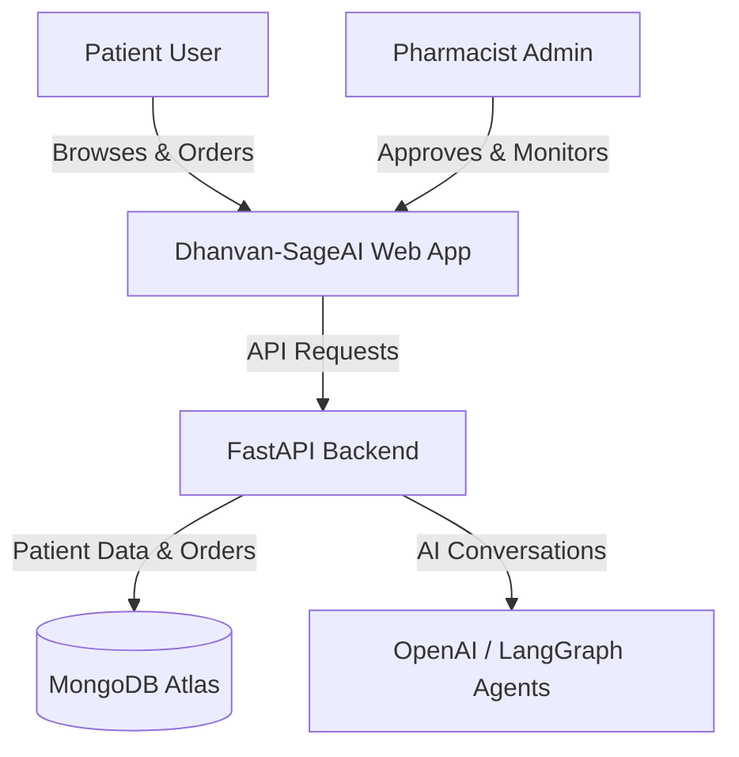

# Business Overview

## Business Context Diagram

## Business Description
- **Business Description**: Dhanvan-SageAI is an autonomous pharmacy intelligence system acting as a digital expert pharmacist. It handles natural language voice/text orders, analyzes prescriptions via vision AI, processes orders, and proactively predicts refill needs.
- **Business Transactions**: Order Placement, Order Approval/Rejection, Prescription Upload, Chat Consultation, Refill Prediction, Inventory Management.
- **Business Dictionary**: PZN (Pharmazentralnummer, medicine ID), Rx (Prescription needed), OTC (Over The Counter).

## Component Level Business Descriptions
### Frontend
- **Purpose**: Provides user interfaces for both patients and pharmacists.
- **Responsibilities**: Voice/text chat, order tracking, alerts viewing, inventory management (pharmacist).

### Backend
- **Purpose**: Central API, AI agent orchestration, and business logic execution.
- **Responsibilities**: Authentication, routing chat to LangGraph agents, DB operations, background cron jobs for refills.
