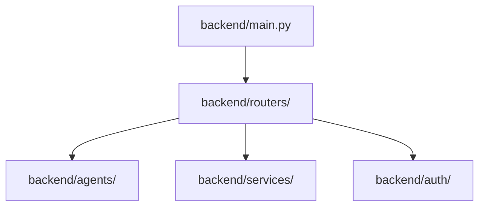

# Code Structure

## Build System
- **Type**: npm (Frontend) / pip (Backend)
- **Configuration**: package.json, vite.config.ts, requirements.txt

## Key Classes/Modules

### Existing Files Inventory
- `backend/main.py` - FastAPI entrypoint, APScheduler initialization
- `backend/agents/pipeline.py` - LangGraph state graph definition
- `backend/routers/chat.py` - HTTP endpoints for chat
- `backend/routers/orders.py` - Order management endpoints
- `backend/auth/jwt_handler.py` - JWT generation and validation
- `frontend/src/pages/PatientDashboard.tsx` - Patient UX, chat UI
- `frontend/src/pages/PharmacistDashboard.tsx` - Admin UX, inventory table

## Design Patterns
### Agentic Pipeline
- **Location**: `backend/agents/`
- **Purpose**: Routing complex user queries to specialized AI agents
- **Implementation**: LangGraph StateGraph with conditional edges

## Critical Dependencies
### FastAPI
- **Version**: 0.115.8
- **Usage**: Backend API
- **Purpose**: High-performance REST framework

### LangGraph
- **Version**: 0.2.73
- **Usage**: Backend Agents
- **Purpose**: Multi-agent orchestration
