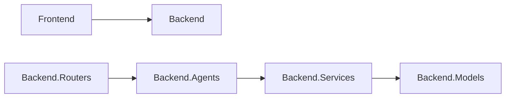

# Dependencies

## Internal Dependencies

### Frontend depends on Backend
- **Type**: Runtime
- **Reason**: API Data fetching

## External Dependencies
### OpenAI
- **Version**: Latest via LangChain
- **Purpose**: LLM Inference
- **License**: Proprietary API
